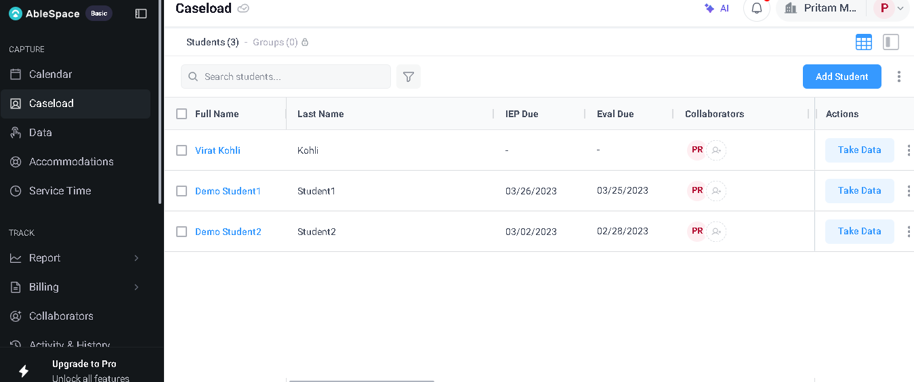
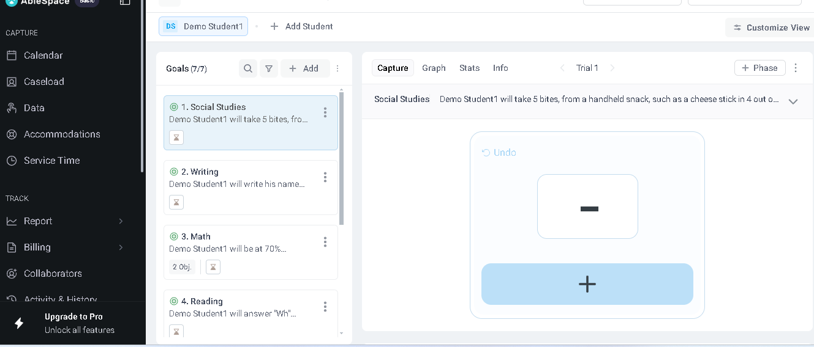
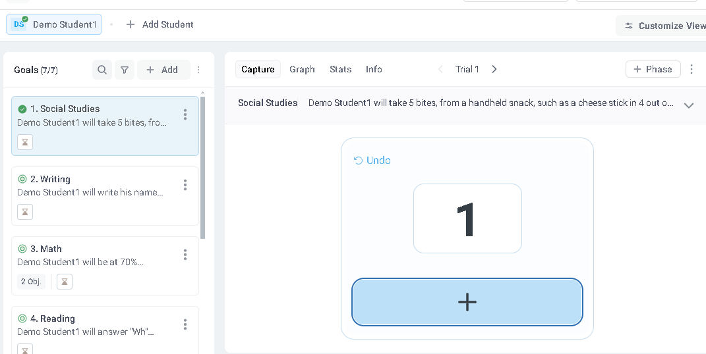
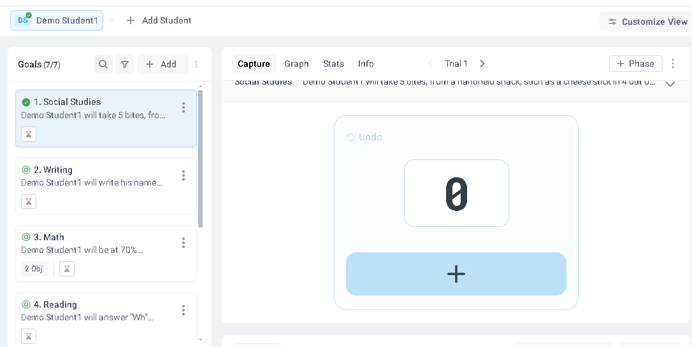
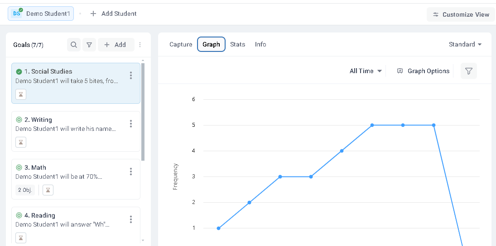
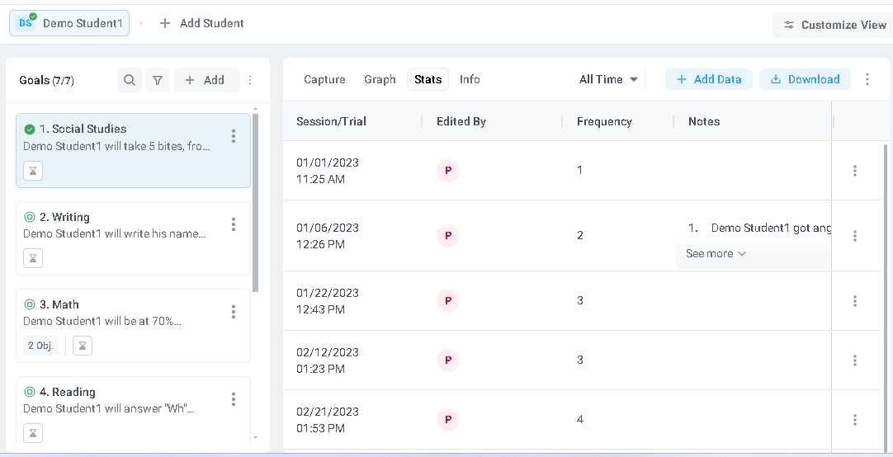
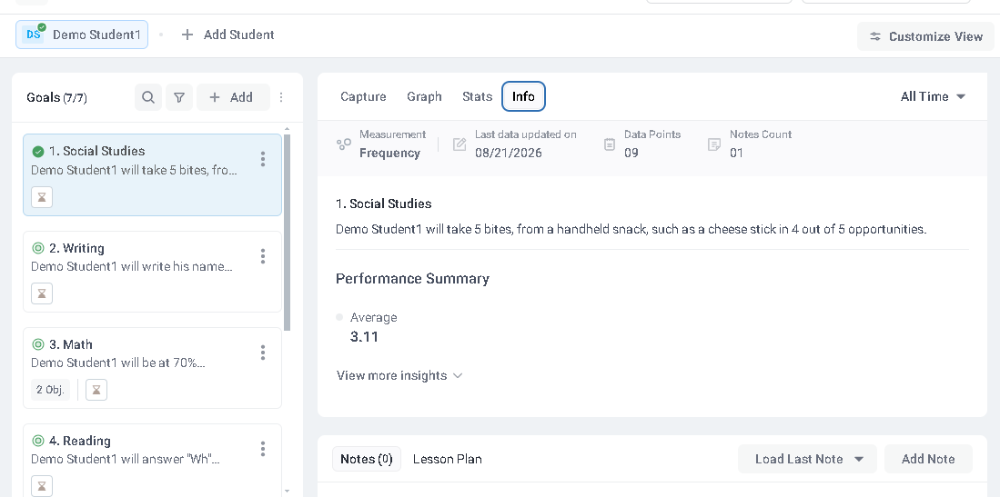
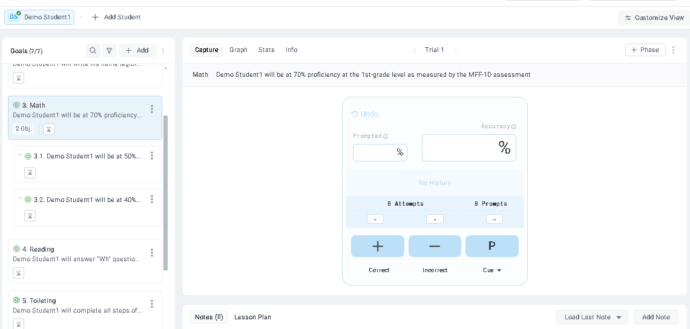

# Part 2: Product Understanding — AbleSpace Take Data Workflow

## Overview

AbleSpace helps users manage student caseloads, track individual goals, record performance data, and review progress.

This document explains the Take Data workflow from the Caseload screen and highlights potential UX/UI and functionality improvements.

All observations are based on the demo student account “Demo Student1.”

## 1. Accessing the Caseload

The Caseload page displays students and relevant information, including:

- Full name.
- Last name.
- IEP due date.
- Evaluation due date.
- Collaborators.
- Available actions.

Each student has a Take Data button in the Actions column.

To begin collecting data, the user clicks Take Data beside the appropriate student.

## 2. Understanding the Take Data Screen

After selecting Take Data for Demo Student1, the application opens a student-specific data collection screen.

The interface contains:

1. A goals panel on the left.
2. A workspace for the selected goal on the right.

The goals panel includes search, filter, and Add controls.

The seven displayed goals are:

- Social Studies.
- Writing.
- Math.
- Reading.
- Toileting.
- Behavior.
- Another Math goal.

Each goal shows its category and a shortened description.

The selected goal can be reviewed through four tabs:

- Capture.
- Graph.
- Stats.
- Info.

## 3. Recording Frequency-Based Data

The Social Studies goal uses frequency-based measurement.

Its full description is:

> Demo Student1 will take 5 bites, from a handheld snack, such as a cheese stick in 4 out of 5 opportunities.

The Capture tab provides a large plus button for recording an occurrence.

When the user clicks the plus button:

1. The displayed count changes to 1.
2. The Undo control becomes available.
3. The interface remains on Trial 1.

The updated counter provides immediate feedback that an occurrence has been recorded.

## 4. Correcting an Entry Using Undo

The Undo control reverses the most recently recorded action.

After clicking Undo, the recorded value changes from 1 to 0.

This allows users to correct accidental entries without leaving the current goal.

## 5. Reviewing Progress in the Graph Tab

The Graph tab presents historical goal data as a line chart.

For the Social Studies goal:

- The vertical axis represents Frequency.
- Recorded values increase from approximately 1 to 5.
- Several observations remain at 5.
- A later visible point drops sharply.

Available controls include:

- An All Time date-range selector.
- Graph Options.
- A filter button.
- A Standard dropdown.

This view helps users recognize progress patterns and changes over time.

## 6. Reviewing Session History in the Stats Tab

The Stats tab presents individual data entries in a table.

Its columns include:

- Session/Trial.
- Edited By.
- Frequency.
- Notes.
- Additional row actions.

Example records include:

| Date | Time | Frequency |
|------|------|-----------|
| 01/01/2023 | 11:25 AM | 1 |
| 01/06/2023 | 12:26 PM | 2 |
| 01/22/2023 | 12:43 PM | 3 |
| 02/12/2023 | 01:23 PM | 3 |
| 02/21/2023 | 01:53 PM | 4 |

The screen also provides:

- An All Time date-range selector.
- Add Data.
- Download.

The Stats view supports detailed review of previously recorded observations.

## 7. Reviewing Goal Details in the Info Tab

The Info tab provides a summary of the selected goal.

The displayed details include:

- Measurement: Frequency.
- Last data updated on: 08/21/2026.
- Data points: 09.
- Notes count: 01.
- Average frequency: 3.11.

Additional available controls include:

- View more insights.
- Notes.
- Lesson Plan.
- Load Last Note.
- Add Note.
- An All Time date-range selector.

This tab combines the goal description, activity information, and performance summary.

## 8. Accuracy-Based Goals and Multiple Objectives

The Math goal demonstrates that the data collection interface changes depending on the measurement method.

Unlike the frequency-based Social Studies goal, the Math goal uses accuracy-based controls.

Its interface includes:

- Correct, represented by a plus button.
- Incorrect, represented by a minus button.
- Cue, represented by a P button and dropdown.
- Accuracy percentage.
- Prompted percentage.
- Attempts.
- Prompts.
- Undo.

The selected Math goal also contains two nested objectives:

1. Objective 3.1, beginning with a 50% target.
2. Objective 3.2, beginning with a 40% target.

This shows that a parent goal can contain multiple measurable objectives.

## UX/UI Improvement Suggestions

### 1. Clarify the Initial Counter State

The frequency counter initially displays a dash. After recording an entry and clicking Undo, it displays 0.

Showing 0 consistently, or explaining the difference between an unrecorded value and a zero value, would make the starting state clearer.

### 2. Show Save Status

The Capture screen does not show an obvious Save button or a visible confirmation that an entry has been saved.

A status such as “Saving...” or “Saved” would improve user confidence.

### 3. Make Goal Descriptions Easier to Read

Descriptions in the goals panel are truncated.

Expandable goal cards, hover previews, or tooltips would make it easier to understand goals without opening each one.

### 4. Distinguish Repeated Goal Categories

The student has two goals labeled Math.

Adding a short goal title, identifier, or objective summary would help users distinguish between similar entries.

### 5. Fix Inconsistent Notes Counts

The Info summary displays “Notes count: 01,” while the lower notes section displays “Notes (0).”

These values should be synchronized or clearly identified as representing different scopes.

### 6. Improve Accessibility

Several controls use small icons and low-contrast text.

Improved contrast, larger interactive targets, descriptive labels, keyboard navigation, and accessible tooltips would improve usability.

### 7. Improve Graph Responsiveness

The graph extends beyond the visible screen area, and horizontal-axis labels are not visible in the screenshot.

A more responsive chart layout and clearer date labels would improve readability.

### 8. Show Full Collaborator Information

The Stats table identifies editors using initials.

Displaying the full name on hover or click would make record ownership easier to understand.

### 9. Explain Accuracy Controls

Labels such as “Cue,” “P,” “Prompts,” and “Prompted” may be unclear to new users.

Short explanations or tooltips would reduce confusion.

### 10. Improve Goal Categorization

The selected goal is categorized as Social Studies, although its description concerns taking bites of food.

Clearer goal categories or descriptive labels would help users locate relevant goals more quickly.

## Functionality Improvement Suggestions

1. Add clear confirmation after recording or saving data.
2. Provide filtering by date, collaborator, objective, or notes.
3. Add keyboard shortcuts for correct, incorrect, and Undo actions.
4. Improve navigation between parent goals and individual objectives.
5. Display trial progress, attempts, and remaining opportunities more clearly.
6. Keep notes counts consistent across different views.
7. Provide a short onboarding walkthrough for new users.

## Conclusion

The Take Data workflow connects student caseload management with goal-specific data collection, visual progress tracking, session history, and performance summaries.

AbleSpace supports different measurement methods, including frequency-based counting and accuracy-based tracking with multiple objectives.

Improvements to save visibility, accessibility, goal identification, graph readability, and notes consistency would make the overall experience clearer and more efficient.